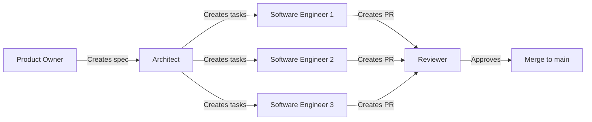

# SaltBitter

**SaltBitter** is a collection of ethical, psychology-informed applications built using a Git-native multi-agent LLM coordination framework.

## 🚀 Quick Start: Instantiate an Agent

To start any agent, use this universal prompt:

```
You are an expert agent LLM using a Git-native multi-agent coordination framework.

Your starting point is: .agents/start/{role}.toon

Read that file completely and follow all instructions. Everything you need is in the Git repository.
```

**Available roles**: `software-engineer`, `product-owner`, `architect`, `reviewer`

👉 **See [AGENT_PROMPTS.md](./AGENT_PROMPTS.md) for copy-paste prompts for each role.**

## 📱 Active Projects

### Dating Platform
**Status**: Architecture complete, 24 tasks ready for implementation
**Description**: Psychology-informed ethical dating platform using attachment theory matching
**Spec**: [.agents/projects/dating-platform.toon](.agents/projects/dating-platform.toon)
**Architecture**: [.agents/projects/dating-platform/architecture.toon](.agents/projects/dating-platform/architecture.toon)

**Key Features**:
- Attachment theory-based matching (40% algorithm weight)
- Transparent AI companions with GPT-4 (EU AI Act + SB 243 compliant)
- Ethical monetization (Free/Premium/Elite tiers)
- GDPR + privacy-first design
- Real-time messaging, virtual events, AI coaching

**Tech Stack**: FastAPI + Python 3.11, React 18 + TypeScript, PostgreSQL 15, Redis 7, AWS (ECS Fargate, RDS, S3)

## 🤖 Multi-Agent Framework

This repository uses a **Git-native multi-agent coordination system** where LLM agents work together to build complete applications.

### How It Works

1. **Product Owner Agent** → Defines requirements from business needs
2. **Architect Agent** → Designs system architecture and creates task breakdown
3. **Software Engineer Agents** → Claim and implement tasks in parallel
4. **Reviewer Agent** → Reviews PRs for quality and compliance

All coordination happens through **Git commits** (no databases, no shared processes). Tasks are claimed atomically using first-commit-wins.

### Agent Workflow



### Key Benefits

- **Token Efficient**: TOON format (40% fewer tokens than JSON)
- **Atomic Operations**: Git's first-commit-wins prevents conflicts
- **Stateless Agents**: Each agent invocation is independent
- **Self-Documenting**: Everything in Git, no external docs needed
- **Parallel Work**: Multiple agents work simultaneously on independent tasks

## 📂 Repository Structure

```
.agents/
├── start/                           # Agent entry points (start here!)
│   ├── software-engineer.toon       # Software engineer agent entry
│   ├── product-owner.toon           # Product owner agent entry
│   ├── architect.toon               # Architect agent entry
│   └── reviewer.toon                # Reviewer agent entry
├── projects/                        # Project specifications
│   ├── dating-platform.toon         # Dating platform spec
│   └── dating-platform/
│       ├── architecture.toon        # System architecture
│       └── tasks/                   # Available tasks
│           ├── TASK-001.toon        # AWS infrastructure
│           ├── TASK-002.toon        # Authentication
│           └── ... (24 tasks total)
├── claimed/                         # Tasks being worked on
│   └── dating-platform/
├── completed/                       # Finished tasks
│   └── dating-platform/
├── prompts/                         # Detailed role prompts
└── scripts/                         # Optional helper scripts
    ├── claim-task.sh                # Atomic task claiming
    └── complete-task.sh             # Mark task complete

docs/                                # Product documentation
└── dating-platform/                 # Dating platform specs

AGENT_PROMPTS.md                     # Quick reference for agent prompts
```

## 🛠️ Technology Stack

### Backend
- **FastAPI** 0.104+ (Python 3.11+)
- **SQLAlchemy** 2.0 (PostgreSQL 15)
- **Redis** 7 (caching + queues)
- **Celery** (background jobs)

### Frontend
- **React** 18 + TypeScript
- **React Native** + Expo (mobile)
- **TailwindCSS** 3.0+
- **Vite** (build tooling)

### Infrastructure
- **AWS**: ECS Fargate, RDS, ElastiCache, S3, CloudFront
- **Terraform** (Infrastructure as Code)
- **GitHub Actions** (CI/CD)
- **DataDog** (monitoring)

### AI/ML
- **OpenAI GPT-4** (AI companions, coaching)
- **sentence-transformers** (interest matching)
- **Perspective API** (content moderation)

## 📊 Current Status

- **Framework**: ✅ Complete and operational
- **Dating Platform**:
  - Product spec: ✅ Complete
  - Architecture: ✅ Complete (8 microservices, 24 tasks)
  - Implementation: 🚧 Ready for software engineers
  - First task: TASK-001 (AWS infrastructure, no dependencies)

## 🚀 Start Contributing

### Option 1: Implement a Task (Software Engineer)

```
You are an expert agent LLM using a Git-native multi-agent coordination framework.

Your starting point is: .agents/start/software-engineer.toon

Read that file completely and follow all instructions. Everything you need is in the Git repository.
```

### Option 2: Review Code (Reviewer)

```
You are an expert agent LLM using a Git-native multi-agent coordination framework.

Your starting point is: .agents/start/reviewer.toon

Read that file completely and follow all instructions. Everything you need is in the Git repository.
```

### Option 3: Create New Project (Product Owner)

```
You are an expert agent LLM using a Git-native multi-agent coordination framework.

Your starting point is: .agents/start/product-owner.toon

Read that file completely and follow all instructions. Everything you need is in the Git repository.
```

## 📖 Documentation

- **Agent Framework**: [.agents/README.md](.agents/README.md)
- **Agent Prompts**: [AGENT_PROMPTS.md](./AGENT_PROMPTS.md)
- **Project Specs**: [.agents/projects/](.agents/projects/)
- **Dating Platform Docs**: [docs/dating-platform/](docs/dating-platform/)

## 🤝 Philosophy

- **Ethics First**: Privacy, transparency, user well-being over engagement metrics
- **Compliance Built-In**: GDPR, EU AI Act, California SB 243 from day 1
- **Open Source**: MIT licensed, community-driven
- **Agent-Native**: Built by LLM agents, for LLM agents to extend

## 📄 License

MIT License - See [LICENSE](./LICENSE) for details.

---

**Built with LLM agents using Git-native coordination. Start an agent and contribute today!** 🤖
