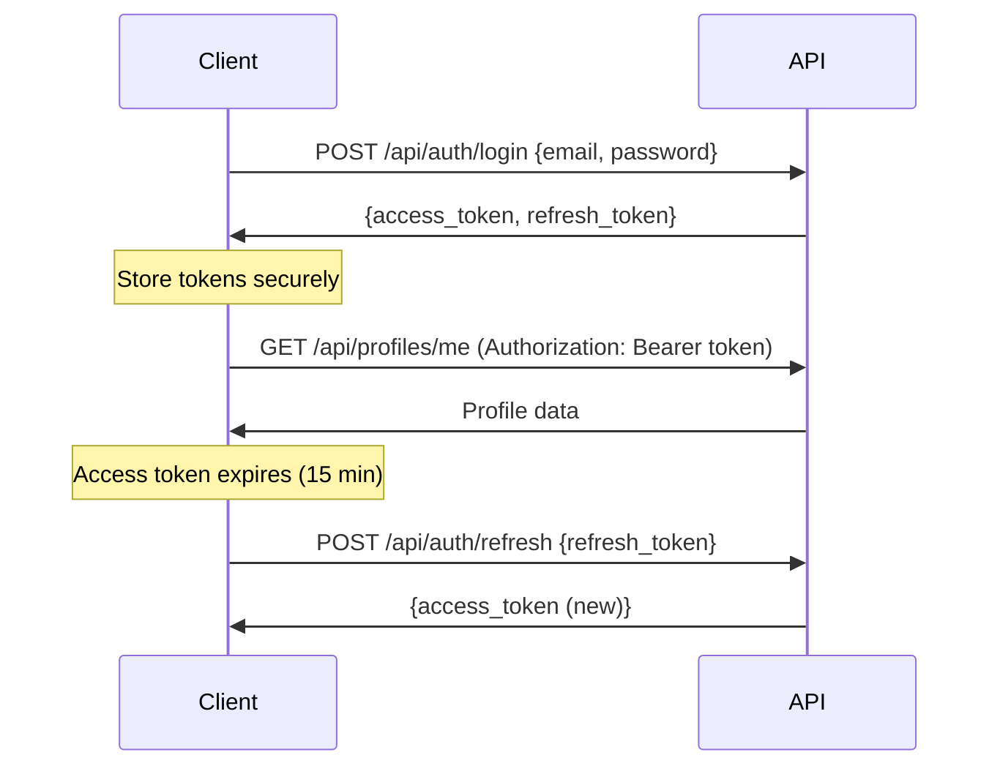

# API Documentation

**SaltBitter Dating Platform REST API**

Version: 1.0.0
Base URL: `https://api.saltbitter.com` (production) | `http://localhost:8000` (development)

## Table of Contents
- [Authentication](#authentication)
- [API Endpoints](#api-endpoints)
- [Interactive Documentation](#interactive-documentation)
- [Rate Limiting](#rate-limiting)
- [Error Handling](#error-handling)
- [Webhooks](#webhooks)

## Authentication

All authenticated endpoints require a JWT access token in the `Authorization` header:

```http
Authorization: Bearer <access_token>
```

### Authentication Flow



### Token Expiration
- **Access Token**: 15 minutes
- **Refresh Token**: 7 days

## Interactive Documentation

**Swagger UI** (auto-generated from FastAPI):
- Development: http://localhost:8000/docs
- Production: https://api.saltbitter.com/docs

**ReDoc** (alternative view):
- Development: http://localhost:8000/redoc
- Production: https://api.saltbitter.com/redoc

## API Endpoints

### Authentication Service

#### POST /api/auth/register
Create a new user account.

**Request:**
```json
{
  "email": "user@example.com",
  "password": "SecurePassword123!",
  "name": "Alex Smith",
  "date_of_birth": "1995-06-15"
}
```

**Response (201 Created):**
```json
{
  "user_id": "550e8400-e29b-41d4-a716-446655440000",
  "email": "user@example.com",
  "name": "Alex Smith",
  "created_at": "2025-11-18T08:00:00Z"
}
```

#### POST /api/auth/login
Login and receive JWT tokens.

**Request:**
```json
{
  "email": "user@example.com",
  "password": "SecurePassword123!"
}
```

**Response (200 OK):**
```json
{
  "access_token": "eyJhbGciOiJIUzI1NiIsInR5cCI6IkpXVCJ9...",
  "refresh_token": "a1b2c3d4e5f6...",
  "token_type": "bearer",
  "expires_in": 900
}
```

#### POST /api/auth/refresh
Refresh expired access token.

**Request:**
```json
{
  "refresh_token": "a1b2c3d4e5f6..."
}
```

**Response (200 OK):**
```json
{
  "access_token": "eyJhbGciOiJIUzI1NiIsInR5cCI6IkpXVCJ9...",
  "token_type": "bearer",
  "expires_in": 900
}
```

#### POST /api/auth/logout
Logout and invalidate refresh token.

**Headers:** `Authorization: Bearer <access_token>`

**Request:**
```json
{
  "refresh_token": "a1b2c3d4e5f6..."
}
```

**Response (200 OK):**
```json
{
  "message": "Logged out successfully"
}
```

---

### Profile Service

#### GET /api/profiles/me
Get current user's profile.

**Headers:** `Authorization: Bearer <access_token>`

**Response (200 OK):**
```json
{
  "user_id": "550e8400-e29b-41d4-a716-446655440000",
  "name": "Alex Smith",
  "bio": "Coffee lover, hiking enthusiast 🏔️",
  "age": 29,
  "location": {
    "city": "San Francisco",
    "country": "USA"
  },
  "photos": [
    "https://cdn.saltbitter.com/photos/user123/1.jpg",
    "https://cdn.saltbitter.com/photos/user123/2.jpg"
  ],
  "interests": ["hiking", "coffee", "photography"],
  "preferences": {
    "age_min": 25,
    "age_max": 35,
    "distance_km": 50
  },
  "subscription_tier": "premium"
}
```

#### PUT /api/profiles/me
Update current user's profile.

**Headers:** `Authorization: Bearer <access_token>`

**Request:**
```json
{
  "bio": "Updated bio",
  "interests": ["hiking", "photography", "cooking"]
}
```

**Response (200 OK):**
```json
{
  "message": "Profile updated successfully"
}
```

#### POST /api/profiles/me/photos
Upload profile photo.

**Headers:** `Authorization: Bearer <access_token>`, `Content-Type: multipart/form-data`

**Request:**
```
file: [binary image data]
```

**Response (201 Created):**
```json
{
  "photo_url": "https://cdn.saltbitter.com/photos/user123/3.jpg",
  "message": "Photo uploaded successfully"
}
```

---

### Attachment Service

#### GET /api/attachment/assessment
Get attachment style assessment questions.

**Headers:** `Authorization: Bearer <access_token>`

**Response (200 OK):**
```json
{
  "questions": [
    {
      "id": 1,
      "text": "I worry about being abandoned",
      "scale": ["Strongly Disagree", "Disagree", "Neutral", "Agree", "Strongly Agree"]
    },
    {
      "id": 2,
      "text": "I prefer not to show others how I feel deep down",
      "scale": ["Strongly Disagree", "Disagree", "Neutral", "Agree", "Strongly Agree"]
    }
    // ... 16 more questions
  ]
}
```

#### POST /api/attachment/assessment
Submit assessment responses.

**Headers:** `Authorization: Bearer <access_token>`

**Request:**
```json
{
  "responses": [
    {"question_id": 1, "answer": 2},
    {"question_id": 2, "answer": 4}
    // ... all responses
  ]
}
```

**Response (201 Created):**
```json
{
  "assessment_id": "650e8400-e29b-41d4-a716-446655440000",
  "style": "secure",
  "anxiety_score": 2.1,
  "avoidance_score": 1.8,
  "insights": "You have a secure attachment style..."
}
```

#### GET /api/attachment/results/{user_id}
Get attachment assessment results (own results only).

**Headers:** `Authorization: Bearer <access_token>`

**Response (200 OK):**
```json
{
  "style": "secure",
  "anxiety_score": 2.1,
  "avoidance_score": 1.8,
  "description": "Secure individuals are comfortable with...",
  "strengths": ["Open communication", "Trust easily"],
  "growth_areas": ["May need to recognize others' attachment needs"]
}
```

---

### Matching Service

#### GET /api/matches
Get today's matches for current user.

**Headers:** `Authorization: Bearer <access_token>`

**Query Parameters:**
- `limit` (optional): Number of matches to return (default: 10)

**Response (200 OK):**
```json
{
  "matches": [
    {
      "match_id": "750e8400-e29b-41d4-a716-446655440000",
      "user_id": "850e8400-e29b-41d4-a716-446655440000",
      "name": "Jordan",
      "age": 27,
      "bio": "Art enthusiast and dog lover 🐕",
      "photos": ["https://cdn.saltbitter.com/photos/jordan/1.jpg"],
      "compatibility_score": 0.87,
      "compatibility_breakdown": {
        "attachment": 0.90,
        "interests": 0.85,
        "values": 0.88,
        "demographics": 0.82
      },
      "distance_km": 12.5
    }
  ],
  "generated_at": "2025-11-18T06:00:00Z"
}
```

#### POST /api/matches/{match_id}/like
Like a match.

**Headers:** `Authorization: Bearer <access_token>`

**Response (200 OK):**
```json
{
  "status": "liked",
  "mutual_match": true,
  "message": "It's a match! 🎉"
}
```

#### POST /api/matches/{match_id}/pass
Pass on a match.

**Headers:** `Authorization: Bearer <access_token>`

**Response (200 OK):**
```json
{
  "status": "passed",
  "message": "Match hidden"
}
```

---

### Compliance Service

#### POST /api/compliance/data-export
Request GDPR data export.

**Headers:** `Authorization: Bearer <access_token>`

**Response (202 Accepted):**
```json
{
  "request_id": "950e8400-e29b-41d4-a716-446655440000",
  "status": "processing",
  "estimated_completion": "2025-11-20T08:00:00Z",
  "message": "Export will be emailed to you within 48 hours"
}
```

#### DELETE /api/compliance/data-deletion
Request account and data deletion (GDPR right to erasure).

**Headers:** `Authorization: Bearer <access_token>`

**Response (202 Accepted):**
```json
{
  "request_id": "a50e8400-e29b-41d4-a716-446655440000",
  "status": "scheduled",
  "deletion_date": "2025-12-18T00:00:00Z",
  "message": "Account will be deleted in 30 days. You can cancel before then."
}
```

---

## Rate Limiting

All endpoints are rate-limited to prevent abuse:

- **Default**: 100 requests per minute per user
- **Authentication endpoints**: 10 requests per minute per IP
- **Photo upload**: 5 requests per minute per user

**Rate Limit Headers:**
```http
X-RateLimit-Limit: 100
X-RateLimit-Remaining: 95
X-RateLimit-Reset: 1700000000
```

**429 Too Many Requests Response:**
```json
{
  "error": "rate_limit_exceeded",
  "message": "Rate limit exceeded. Max 100 requests per minute.",
  "retry_after": 45
}
```

---

## Error Handling

All errors follow a consistent format:

```json
{
  "error": "error_code",
  "message": "Human-readable error message",
  "details": {
    "field": "validation error details"
  }
}
```

### HTTP Status Codes

| Code | Meaning | Usage |
|------|---------|-------|
| 200 | OK | Successful request |
| 201 | Created | Resource created successfully |
| 202 | Accepted | Request accepted, processing asynchronously |
| 400 | Bad Request | Invalid request parameters |
| 401 | Unauthorized | Missing or invalid authentication token |
| 403 | Forbidden | Authenticated but not authorized |
| 404 | Not Found | Resource does not exist |
| 429 | Too Many Requests | Rate limit exceeded |
| 500 | Internal Server Error | Server-side error |
| 503 | Service Unavailable | Temporary service disruption |

### Common Error Codes

| Error Code | Description |
|------------|-------------|
| `invalid_credentials` | Email or password incorrect |
| `token_expired` | JWT access token expired |
| `token_invalid` | JWT token malformed or invalid |
| `email_already_exists` | Email already registered |
| `resource_not_found` | Requested resource does not exist |
| `validation_error` | Request body validation failed |
| `rate_limit_exceeded` | Too many requests |
| `insufficient_permissions` | User lacks required permissions |
| `payment_required` | Feature requires premium subscription |

---

## Webhooks

External services can register webhooks for real-time notifications:

### Stripe Payment Events

**Endpoint:** `POST /webhooks/stripe`

**Headers:** `stripe-signature: <signature>`

**Events:**
- `invoice.payment_succeeded` - Subscription payment succeeded
- `invoice.payment_failed` - Subscription payment failed
- `customer.subscription.updated` - Subscription tier changed
- `customer.subscription.deleted` - Subscription canceled

---

## OpenAPI Specification

Full OpenAPI 3.1 specification available at:
- JSON: `/openapi.json`
- YAML: `/openapi.yaml`

---

## Client SDKs

### Python
```python
from saltbitter import SaltBitterClient

client = SaltBitterClient(api_key="your_api_key")
matches = client.matches.list(limit=10)
```

### TypeScript
```typescript
import { SaltBitterClient } from '@saltbitter/sdk';

const client = new SaltBitterClient({ apiKey: 'your_api_key' });
const matches = await client.matches.list({ limit: 10 });
```

---

## Support

- **API Status**: https://status.saltbitter.com
- **Documentation**: https://docs.saltbitter.com
- **Developer Support**: dev@saltbitter.com
- **Changelog**: https://docs.saltbitter.com/changelog

---

**Last Updated**: 2025-11-18
**API Version**: 1.0.0
