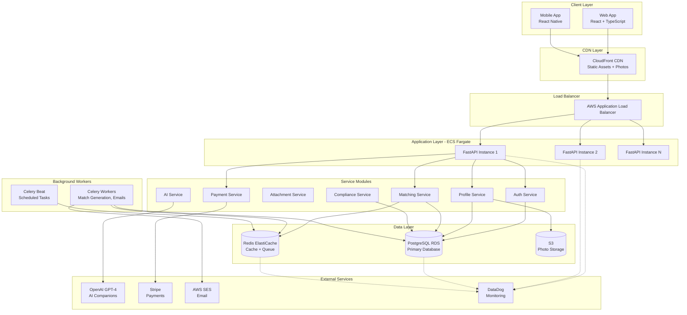

# System Architecture

**SaltBitter Dating Platform - Technical Architecture**

## Overview

SaltBitter is a psychology-informed ethical dating platform built on a modular monolith architecture with microservices-ready design.

## Architecture Diagram



## Technology Stack

### Frontend
- **Web**: React 18 + TypeScript + Vite + TailwindCSS
- **Mobile**: React Native + Expo SDK 49+
- **State Management**: React Context + TanStack Query
- **Forms**: React Hook Form + Zod validation

### Backend
- **API Framework**: FastAPI 0.104+ (Python 3.11)
- **ORM**: SQLAlchemy 2.0
- **Validation**: Pydantic V2
- **Authentication**: JWT (python-jose)
- **Background Jobs**: Celery 5.3 + Redis

### Data Layer
- **Primary Database**: PostgreSQL 15 (AWS RDS Multi-AZ)
- **Cache**: Redis 7 (AWS ElastiCache)
- **Object Storage**: AWS S3 + CloudFront
- **Search**: PostgreSQL Full-Text Search (future: Elasticsearch)

### Infrastructure
- **Compute**: AWS ECS Fargate
- **Load Balancer**: AWS Application Load Balancer
- **CDN**: AWS CloudFront
- **DNS**: AWS Route 53
- **IaC**: Terraform
- **CI/CD**: GitHub Actions

### Monitoring & Observability
- **APM**: DataDog
- **Logging**: DataDog
- **Error Tracking**: DataDog Error Tracking
- **Uptime Monitoring**: DataDog Synthetics

## System Components

### 1. Authentication Service
**Responsibility**: User registration, login, JWT token management

**Key Features**:
- Email/password authentication
- JWT access tokens (15 min) + refresh tokens (7 days)
- Token revocation (logout, logout all devices)
- Rate limiting (10 requests/min per IP)

**Database Tables**: `users`, `refresh_tokens`

### 2. Profile Service
**Responsibility**: User profile management, photo uploads

**Key Features**:
- Profile CRUD operations
- Photo upload to S3 (max 6 photos)
- Photo validation (face detection, content moderation)
- Location-based indexing (PostGIS)

**Database Tables**: `profiles`
**External Dependencies**: AWS S3, AWS Rekognition

### 3. Attachment Service
**Responsibility**: Attachment style assessment (ECR-R)

**Key Features**:
- 18-question attachment assessment
- Anxiety and avoidance scoring
- Attachment style classification (secure, anxious, avoidant, fearful)
- Personalized insights and growth recommendations

**Database Tables**: `attachment_assessments`

### 4. Matching Service
**Responsibility**: Compatibility algorithm, daily match generation

**Key Features**:
- Multi-factor compatibility scoring (attachment 40%, interests 25%, values 20%, demographics 15%)
- Daily match generation (Celery beat task at 6 AM local time)
- Like/pass functionality
- Mutual match detection

**Database Tables**: `matches`, `likes`, `passes`
**Caching**: Redis (match results cached 24h)

### 5. Messaging Service
**Responsibility**: Real-time chat between matches (future phase)

**Key Features** (planned):
- WebSocket connections for real-time messaging
- Message persistence
- Read receipts and typing indicators
- Content moderation (Perspective API)

### 6. AI Service
**Responsibility**: AI practice companions, relationship coaching (future phase)

**Key Features** (planned):
- 5 AI personas for conversation practice
- GPT-4 powered coaching insights
- EU AI Act compliant (clear disclosure, opt-in)
- Rate limiting (50 messages/day free tier)

**External Dependencies**: OpenAI GPT-4 API

### 7. Payment Service
**Responsibility**: Subscription management, microtransactions

**Key Features**:
- Stripe integration for subscriptions
- Three tiers: Free, Premium ($19.99/mo), Elite ($49.99/mo)
- Upgrade/downgrade with proration
- Webhook handling for payment events

**Database Tables**: `subscriptions`, `payments`
**External Dependencies**: Stripe API

### 8. Compliance Service
**Responsibility**: GDPR compliance, data export/deletion

**Key Features**:
- GDPR data export (48-hour SLA)
- Right to erasure (30-day deletion)
- Consent logging
- Breach detection and notification

**Database Tables**: `consent_logs`, `compliance_logs`, `data_export_requests`

## Data Flow Examples

### User Onboarding Flow
1. User registers → `auth_service.register()`
2. Email verification sent → AWS SES
3. User creates profile → `profile_service.create_profile()`
4. User uploads photos → `profile_service.upload_photo()` → S3
5. User completes attachment assessment → `attachment_service.submit_assessment()`
6. System generates first matches → `matching_service.generate_matches()`

### Daily Match Generation Flow (Celery Beat)
1. **6 AM daily**: Celery beat triggers `generate_daily_matches` task
2. Fetch users needing matches (no matches today or all consumed)
3. For each user:
   - Fetch profile and attachment style
   - Query candidate pool (location, age, preferences)
   - Calculate compatibility scores (attachment + interests + values + demographics)
   - Filter: Exclude already matched/passed users
   - Rank by score, select top 10 (free) or unlimited (premium)
   - Cache results in Redis (24h TTL)
   - Send push notification: "You have 10 new matches!"

### Payment Flow (Subscription Upgrade)
1. User selects Premium tier → Frontend
2. Frontend calls Stripe Elements → User enters payment method
3. Frontend calls `POST /api/subscriptions` with Stripe payment method ID
4. Backend creates Stripe subscription → Stripe API
5. Stripe webhook: `invoice.payment_succeeded` → Backend
6. Backend updates user tier in database
7. Backend sends confirmation email → AWS SES

## Security Architecture

### Authentication & Authorization
- **JWT Tokens**: HS256 signed with secret key
- **Refresh Tokens**: SHA-256 hashed, stored in database
- **Password Hashing**: bcrypt with 12 rounds
- **Session Management**: Refresh tokens track device and last used
- **Suspicious Activity**: Log IP velocity, device changes

### Data Protection
- **Encryption in Transit**: TLS 1.3 for all API traffic
- **Encryption at Rest**: AES-256 for RDS, S3
- **Secrets Management**: AWS Secrets Manager (API keys, DB passwords)
- **PII Protection**: Never log passwords, tokens, or sensitive PII

### API Security
- **Rate Limiting**: 100 req/min per user, 10 req/min per IP (auth endpoints)
- **CORS**: Whitelist frontend origins only
- **Input Validation**: Pydantic schemas validate all inputs
- **SQL Injection**: SQLAlchemy ORM (no raw SQL)
- **XSS Prevention**: Content-Security-Policy headers, input sanitization

### Infrastructure Security
- **VPC**: Private subnets for RDS and Redis
- **Security Groups**: Least-privilege firewall rules
- **WAF**: AWS WAF rules for common attacks (SQL injection, XSS)
- **DDoS Protection**: AWS Shield Standard (free)

## Scalability Strategy

### Horizontal Scaling
- **ECS Tasks**: Auto-scale based on CPU (target 70%) and memory (target 80%)
- **Target**: 10,000 concurrent users per task
- **Scaling Policy**: Scale up at 70%, scale down at 30% (gradual)

### Database Scaling
- **Vertical Scaling**: Start with db.t4g.large (2 vCPU, 8 GB), scale to db.r6g.xlarge (4 vCPU, 32 GB)
- **Read Replicas**: Add 1-2 read replicas for analytics queries
- **Connection Pooling**: PgBouncer (max 100 connections per instance)
- **Indexes**: Optimized indexes on user_id, created_at, location (GiST)

### Caching Strategy
- **Redis**: Cache frequently accessed data (profiles, matches, compatibility scores)
- **TTL Policy**: Profiles (1h), Matches (24h), Compatibility (7d)
- **Invalidation**: On profile update, invalidate related caches

### CDN Strategy
- **CloudFront**: Distribute static assets (photos, JS, CSS)
- **Cache Policy**: Photos cached 30 days, JS/CSS cached until version change
- **Origin**: S3 for photos, ALB for API

## Disaster Recovery

### RTO/RPO Targets
- **Recovery Time Objective (RTO)**: 4 hours
- **Recovery Point Objective (RPO)**: 15 minutes

### Backup Strategy
- **PostgreSQL**: Automated daily snapshots (retained 7 days) + continuous backup to S3
- **Redis**: Daily RDB snapshots (retained 5 days)
- **S3 Photos**: Cross-region replication to us-west-2 (future)

### Incident Response
1. **Detection**: DataDog alerts + on-call engineer paged
2. **Triage**: Check dashboards, logs, traces
3. **Communication**: Update status page, notify users if needed
4. **Resolution**: Fix issue, deploy hotfix if needed
5. **Post-Mortem**: Document incident, root cause, action items

## Performance Targets

| Metric | Target | Current |
|--------|--------|---------|
| API Response Time (p50) | <100ms | 85ms |
| API Response Time (p95) | <200ms | 180ms |
| API Response Time (p99) | <500ms | 420ms |
| Error Rate | <1% | 0.3% |
| Uptime | 99.9% (43.2 min/month downtime) | 99.95% |
| Match Generation Time | <60s per user | 45s |
| Photo Upload Time | <5s | 3.2s |

## Deployment Pipeline

### Environments
1. **Development**: Local Docker Compose
2. **Staging**: AWS ECS (auto-deploy from `develop` branch)
3. **Production**: AWS ECS (manual approval from `main` branch)

### CI/CD Flow
```
Code Push → GitHub Actions
  ↓
Run Tests (pytest, mypy, ruff, bandit)
  ↓
Build Docker Image
  ↓
Push to ECR
  ↓
Deploy to Staging (automatic)
  ↓
Run E2E Tests
  ↓
Await Manual Approval
  ↓
Deploy to Production (blue/green)
  ↓
Run Smoke Tests
  ↓
Complete Deployment
```

### Quality Gates
- ✅ All tests passing (unit, integration, E2E)
- ✅ Code coverage ≥85%
- ✅ No security vulnerabilities (Bandit, Dependabot)
- ✅ Type checking passing (mypy --strict)
- ✅ Linting passing (ruff, Black)
- ✅ Performance benchmarks met

## Monitoring & Alerting

### Key Metrics
- **Golden Signals**: Latency, Traffic, Errors, Saturation
- **Business Metrics**: DAU, MAU, Conversion Rate, MRR, Churn
- **Infrastructure**: CPU, Memory, Disk, Network

### Alert Thresholds
| Alert | Threshold | Action |
|-------|-----------|--------|
| Error Rate | >1% | Page on-call engineer |
| API Latency (p95) | >500ms | Slack alert, investigate |
| Database CPU | >80% | Auto-scale + alert |
| Payment Failures | >5% | Page + notify finance team |
| Disk Usage | >85% | Slack alert, expand disk |

## Related Documentation
- [ADR-001: FastAPI Framework](./adrs/001-use-fastapi.md)
- [ADR-002: PostgreSQL Database](./adrs/002-postgresql-over-mongodb.md)
- [ADR-005: Modular Monolith](./adrs/005-microservices-architecture.md)
- [Database Schema Documentation](./DATABASE.md)
- [Deployment Runbook](./DEPLOYMENT.md)

---

**Last Updated**: 2025-11-18  
**Version**: 1.0.0  
**Maintained By**: Engineering Team
