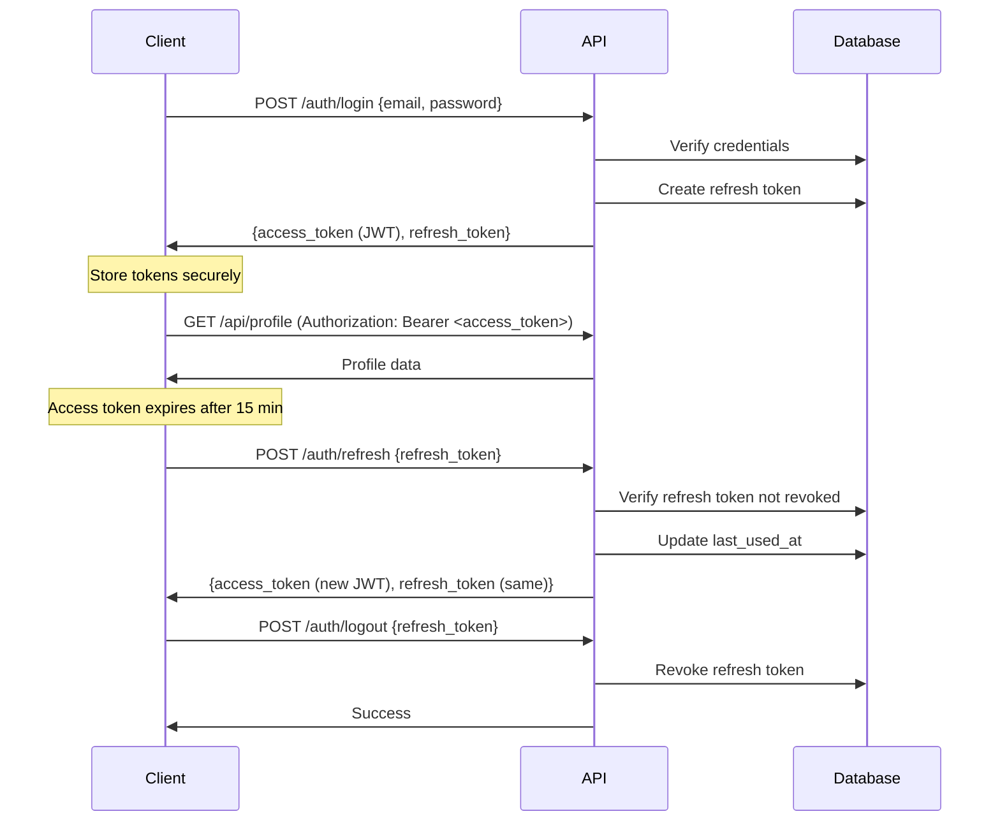

# ADR-006: JWT Authentication with Short-Lived Access Tokens

## Status
Accepted

## Context
We need a secure, scalable authentication strategy for the SaltBitter platform. The system requires:
- API authentication for web and mobile clients
- WebSocket authentication for real-time messaging
- Stateless authentication (no session server)
- Token revocation capability
- Protection against common attacks (XSS, CSRF, token theft)

### Authentication Options

**Option A: Session-Based (cookies + server-side sessions)**
- Pros: Easy revocation, secure
- Cons: Not stateless, doesn't work well with mobile apps, requires session store

**Option B: JWT with Long-Lived Tokens**
- Pros: Stateless, works across web/mobile
- Cons: Cannot revoke tokens, long exposure window if stolen

**Option C: JWT with Short Access + Long Refresh Tokens**
- Pros: Stateless, revocable (via refresh token), limited exposure
- Cons: More complex flow, refresh endpoint needed

## Decision
We will use **JWT authentication with short-lived access tokens (15 minutes) and long-lived refresh tokens (7 days)**.

## Implementation Details

### Token Structure

**Access Token** (JWT, 15-minute expiration)
```json
{
  "sub": "user-uuid",
  "email": "user@example.com",
  "subscription_tier": "elite",
  "iat": 1700000000,
  "exp": 1700000900,
  "type": "access"
}
```

**Refresh Token** (Opaque, 7-day expiration, stored in database)
```python
@dataclass
class RefreshToken:
    id: UUID
    user_id: UUID
    token_hash: str  # SHA-256 hash
    expires_at: datetime
    created_at: datetime
    last_used_at: datetime
    revoked: bool = False
    device_info: str  # User agent for tracking
```

### Authentication Flow



### Security Measures

**1. Token Storage**
```typescript
// Web: HttpOnly cookies for refresh token (XSS protection)
// Access token in memory only (cleared on page refresh)

// Mobile: Secure keychain storage
import * as SecureStore from 'expo-secure-store';
await SecureStore.setItemAsync('refresh_token', token);
```

**2. Token Rotation**
```python
@router.post("/auth/refresh")
async def refresh_access_token(refresh_token: str):
    # Verify refresh token
    token_record = await db.get_refresh_token(refresh_token)

    if not token_record or token_record.revoked:
        raise HTTPException(status_code=401, detail="Invalid refresh token")

    if token_record.expires_at < datetime.utcnow():
        raise HTTPException(status_code=401, detail="Refresh token expired")

    # Update last used timestamp (for suspicious activity detection)
    await db.update_refresh_token_usage(token_record.id)

    # Generate new access token
    access_token = create_access_token(user_id=token_record.user_id)

    return {"access_token": access_token, "token_type": "bearer"}
```

**3. Token Revocation**
```python
@router.post("/auth/logout")
async def logout(
    refresh_token: str,
    current_user: User = Depends(get_current_user)
):
    # Revoke specific refresh token
    await db.revoke_refresh_token(refresh_token)
    return {"message": "Logged out successfully"}

@router.post("/auth/logout-all")
async def logout_all_devices(current_user: User = Depends(get_current_user)):
    # Revoke all refresh tokens for user (e.g., password change, security concern)
    await db.revoke_all_refresh_tokens(current_user.id)
    return {"message": "Logged out from all devices"}
```

**4. Suspicious Activity Detection**
```python
async def detect_suspicious_activity(token_record: RefreshToken, request: Request):
    """Flag potential token theft."""

    # Check if device info changed drastically
    if token_record.device_info != request.headers.get("User-Agent"):
        await security_logger.log_warning(
            "Device mismatch for refresh token",
            user_id=token_record.user_id,
            original_device=token_record.device_info,
            current_device=request.headers.get("User-Agent")
        )

    # Check if used from different IP in short time
    if await check_ip_velocity(token_record.user_id):
        await security_logger.log_warning(
            "Rapid IP change detected",
            user_id=token_record.user_id
        )
        # Optional: Force re-authentication
```

### Rate Limiting

```python
# Prevent brute force on refresh endpoint
@router.post("/auth/refresh")
@rate_limit(max_requests=10, window_seconds=60)
async def refresh_access_token(refresh_token: str):
    ...
```

## Consequences

### Positive
- **Stateless API**: Access tokens verified without database lookup
- **Revocable**: Refresh tokens stored in DB, can be revoked immediately
- **Limited Exposure**: Stolen access token valid for only 15 minutes
- **Cross-Platform**: Works for web, mobile, and WebSocket authentication
- **Scalability**: No session store needed, easy to scale horizontally
- **Granular Control**: Can logout specific device or all devices
- **Security**: HttpOnly cookies + memory storage prevents XSS attacks

### Negative
- **Complexity**: Two-token flow more complex than simple sessions
- **Database Dependency**: Refresh endpoint requires DB lookup
- **Token Management**: Clients must handle token refresh logic
- **Race Conditions**: Concurrent requests near expiration may fail

### Mitigation
- Provide client SDKs with automatic token refresh logic
- Implement retry logic for 401 errors
- Set generous buffer before expiration (refresh at 10 min mark)
- Use connection pooling for refresh token database queries

## Alternative Considered: OAuth 2.0 with External Provider

We considered delegating authentication to Google/Apple/Facebook:

**Pros**: No password management, easier for users, social graph integration
**Cons**: Vendor lock-in, GDPR concerns with third-party data sharing, dating app privacy (users don't want linked to social)

**Decision**: Implement own auth first, add social login as optional later (TASK-023)

## Related Decisions
- ADR-001: FastAPI framework (native JWT support)
- ADR-002: PostgreSQL (stores refresh tokens)
- ADR-007: Redis for rate limiting

## References
- [RFC 7519: JWT Specification](https://datatracker.ietf.org/doc/html/rfc7519)
- [OWASP JWT Cheat Sheet](https://cheatsheetseries.owasp.org/cheatsheets/JSON_Web_Token_for_Java_Cheat_Sheet.html)
- [Auth0 Token Best Practices](https://auth0.com/docs/secure/tokens)

## Date
2025-11-17

## Authors
- Architect Agent
- Security Team
